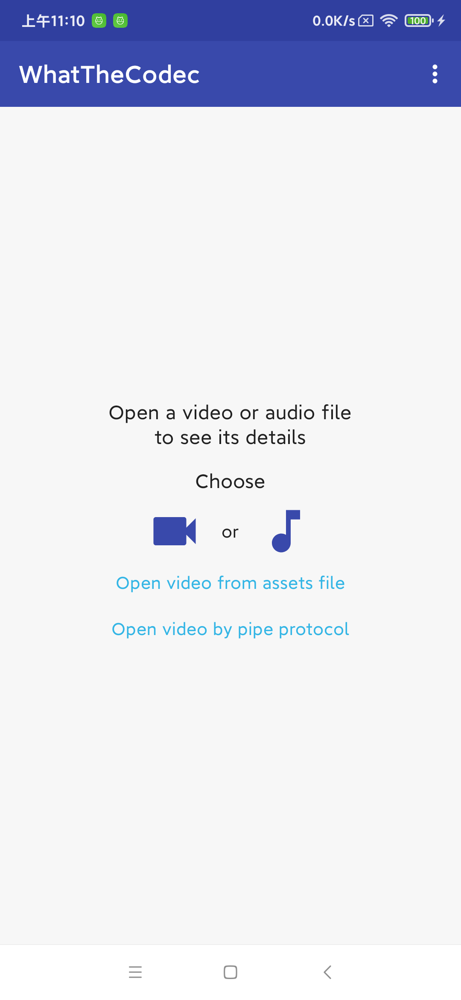

# What the Codec

[English](README_EN.md)

Foke自[What the Codec](https://github.com/Javernaut/WhatTheCodec)

## 修改点

* 修复了"FFmpeg在对带有startOffset的mov格式的媒体文件时不能正常读取的问题"

  * 详细见： [FFmpegForAndroidAssetFileDescriptor](https://github.com/YiChaoLove/FFmpegForAndroidAssetFileDescriptor)

* 演示了如何使用pipe协议

  * 当使用pipe协议是，我们需要创建一个单独的线程来向pipe中写入数据，因为pipe的缓冲区大小是有限制的。

  * 当FFmpeg在解复用mov格式的文件时会先搜索`moov`，如果`moov`在视频文件尾部，解复用可能发生错误，你可以使用`faststart`来将`moov`调整到视频文件头部

    ```shell
    ffmpeg -i video.mp4 -c copy -movflags +faststart output.mp4
    ```

  * 修复原始工程中`loadNextFrameInto(bitmap: Bitmap)`函数在视频存在B/P帧时返回错误截图的问题

## 运行

1. 添加FFmpeg依赖

   ```
   git submodule update --init
   
   cd FFmpegForAndroidAssetFileDescriptor
   
   chmod u+x ffmpeg_build_android.sh
   
   sudo ./ffmpeg_build_android.sh
   ```

2. 运行app

   

## 其他问题

* 如果你想要将其移植到你的工程，你应该着重关注`media_file_builder_jni.cpp`和`MediaFileBuilder.kt`即可

* 这只是一个Demo工程，项目中有诸多不当之处，如果你想要将其用于生产环境需要注意以下几个问题

  1. 工程中在调用FFmpeg的部分函数失败时并没有free相关资源，如：

     ```c++
     static void media_file_build(jobject jMediaFileBuilder, const char *uri, int mediaStreamsMask, AVFormatContext *avFormatContext) {
         if (avformat_open_input(&avFormatContext, uri, nullptr, nullptr)) {
             onError(jMediaFileBuilder);//没有释放avFormatContext
             return;
         }
     		....
     }
     ```

  2. 工程中在调用FFmpeg的部分函数失败时没有关注错误码，如上述代码`avformat_open_input`调用失败后并没有打印错误

     